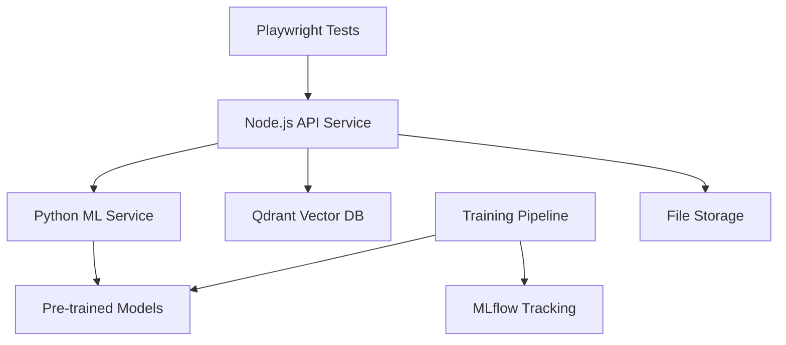

# Advanced Visual Anomaly Testing Stack

🎯 **Enterprise-grade visual regression testing with AI/ML-powered analysis**

A comprehensive, self-hosted visual anomaly detection system that combines computer vision, deep learning, and intelligent triage to provide Percy/Applitools-like capabilities without SaaS dependencies.

## 🚀 Key Features

### Advanced Computer Vision & ML
- **Multi-metric Analysis**: SSIM, LPIPS, ViT distance, pixel diff, texture analysis
- **Object Detection**: YOLO-based UI component detection  
- **Semantic Analysis**: CLIP embeddings for semantic similarity
- **OCR Integration**: Text content analysis with EasyOCR
- **Segmentation**: SAM (Segment Anything Model) for precise diff regions
- **Feature Engineering**: 30+ advanced visual features for anomaly detection

### Intelligent Triage System
- **Rule-based Analysis**: Configurable severity levels (critical, warning, info)
- **Smart Recommendations**: Contextual suggestions for masking and fixes  
- **Historical Context**: Vector similarity search for past failures
- **CI/CD Integration**: Pass/fail decisions with detailed reporting

### ML Training & Optimization
- **AutoML Pipeline**: Hyperparameter optimization with Optuna
- **Model Ensemble**: XGBoost, LightGBM, CatBoost combination
- **Active Learning**: Continuous improvement with uncertain samples
- **Experiment Tracking**: MLflow integration for model versioning
- **Data Validation**: Great Expectations for data quality

### Production-Ready Architecture  
- **Containerized Services**: Docker Compose orchestration
- **Vector Database**: Qdrant for similarity search and embeddings
- **Scalable API**: Express.js with rate limiting and security
- **Performance Monitoring**: Built-in performance impact measurement
- **Artifact Management**: Organized baseline/candidate storage

## 🏗️ Architecture



### Services

- **`services/api/`** - Node.js API for orchestration, storage, and triage
- **`services/ml/`** - Python FastAPI for visual analysis and ML inference  
- **`services/training/`** - ML training pipeline with AutoML capabilities
- **`ui-tests/`** - Playwright test suite with advanced helpers
- **`qdrant`** - Vector database for similarity search
- **`mlflow`** - Experiment tracking and model registry

## 🚦 Quick Start

### Prerequisites
- Docker & Docker Compose
- Node.js 18+ (for UI tests)
- NVIDIA GPU (recommended for ML training)

### 1. Start Services
```bash
# Boot all services
docker compose up --build -d

# Check service health
curl http://localhost:8080/health
curl http://localhost:8000/health
```

### 2. Install Test Dependencies  
```bash
cd ui-tests
npm install
npx playwright install --with-deps
```

### 3. Run Visual Tests
```bash
# Set your application URL
export APP_URL=http://localhost:3000
export VISUAL_API=http://localhost:8080

# Run tests
npm test
```

## 📊 ML Training Pipeline

### Automated Training
```bash
# Run with Docker Compose
docker compose --profile training up training

# Or run directly
cd services/training
python train_pipeline.py --experiment-name my-experiment --max-samples 10000
```

### Training Features
- **Data Collection**: Automatic collection from Qdrant + manual labels
- **Feature Engineering**: 30+ computer vision features
- **Hyperparameter Tuning**: Optuna optimization (50+ trials per model)
- **Model Ensemble**: Best-performing model selection
- **Active Learning**: Query most informative samples for labeling
- **Validation**: Cross-validation with stratified splits

### Training Metrics Tracked
- ROC AUC, Precision, Recall, F1-Score
- Feature importance rankings
- Model performance comparisons
- Training/validation curves
- Hyperparameter distributions

## 🎭 Intelligent Masking

### Automatic Mask Detection
```typescript
import { MaskHelper } from './helpers/mask-helper';

const maskHelper = new MaskHelper();

// Auto-detect dynamic content
const masks = await maskHelper.computeAdaptiveMasks(page, {
  detectText: true,      // Time, dates, counters
  detectImages: true,    // User avatars, dynamic images  
  detectAnimations: true // CSS animations, loading states
});
```

### Pre-built Mask Rules
- **Timestamps**: `[data-testid*="time"]`, `.timestamp`, `time[datetime]`
- **User Content**: `.user-avatar`, `.username`, `[data-testid*="user"]`
- **Dynamic Numbers**: `.counter`, `.metric`, `[data-testid*="count"]`
- **Loading States**: `.loading`, `.spinner`, `[data-loading="true"]`
- **Notifications**: `.notification`, `[role="alert"]`

## 📈 Performance Impact Analysis

### Built-in Performance Monitoring
```typescript
import { PerformanceHelper } from './helpers/performance-helper';

const perfHelper = new PerformanceHelper();

// Measure page load impact
const metrics = await perfHelper.measurePageLoad(page, '/dashboard');

// Benchmark visual testing overhead  
const overhead = await perfHelper.benchmarkVisualTestingOverhead(
  page,
  () => page.goto('/'), // Baseline
  () => visualHelper.captureAndAnalyze(page, 'test'), // With visual testing
  5 // iterations
);

console.log(`Visual testing adds ${overhead.overheadPercentage.toFixed(1)}% overhead`);
```

## 🔧 Advanced Configuration

### Environment Variables
```bash
# API Configuration
VISUAL_API=http://localhost:8080
ML_URL=http://ml:8000
QDRANT_URL=http://qdrant:6333
MLFLOW_URL=http://mlflow:5000

# Test Configuration  
APP_URL=http://localhost:3000
PROJECT_ID=my-project
BRANCH=main
ANOMALY_THRESHOLD=0.25
CONFIDENCE_THRESHOLD=0.8

# ML Options
ENABLE_SAM=true
ENABLE_TEXTURE=true
ENABLE_SIMILARITY=true
MAX_SIMILAR_RESULTS=5
```

### Custom Triage Rules
```javascript
// In your test configuration
const customRules = [
  {
    name: 'critical_layout_shift',
    severity: 'critical',
    condition: (metrics, analysis) => 
      metrics.anomaly_score > 0.6 && metrics.ssim < 0.7,
    message: 'Major layout disruption detected'
  }
];
```

## 🎯 Test Examples

### Basic Visual Test
```typescript
test('homepage visual regression', async ({ page }) => {
  await page.goto('/');
  
  await performVisualTest(page, 'homepage', {
    maskSelectors: [
      '[data-testid="current-time"]',
      '.user-avatar',
      '.notification-count'
    ],
    waitForSelectors: ['main', 'header', 'footer'],
    customThresholds: { anomaly: 0.2 }
  });
});
```

### Advanced Multi-Viewport Test  
```typescript
test('responsive visual consistency', async ({ page }) => {
  const viewports = [
    { width: 1920, height: 1080, name: 'desktop' },
    { width: 768, height: 1024, name: 'tablet' },
    { width: 375, height: 667, name: 'mobile' }
  ];
  
  for (const viewport of viewports) {
    await page.setViewportSize(viewport);
    await performVisualTest(page, `dashboard-${viewport.name}`);
  }
});
```

## 📊 Reporting & Analytics

### Test Summary Report
Each test run generates comprehensive analytics:

```
📊 Visual Testing Summary
========================
Run ID: 2024-01-15-abc123
Project: my-app (main)
Tests: 25 total, 23 passed, 2 failed  
Anomalies: 5 detected (avg score: 0.234)
Critical Issues: 2

💡 Recommendations:
   1. Consider masking dynamic timestamps in header
   2. Investigate layout shifts in mobile viewport
   3. Update baselines for intentional design changes
```

### MLflow Experiment Tracking
- Model performance comparisons
- Feature importance analysis  
- Hyperparameter optimization results
- Training metrics over time

### Qdrant Analytics
- Visual similarity patterns
- Anomaly clustering analysis
- Historical failure trends
- Embedding space visualization

## 🔄 CI/CD Integration

### GitHub Actions
```yaml
name: Visual Regression Tests
on: [pull_request]

jobs:
  visual-tests:
    runs-on: ubuntu-latest
    steps:
      - uses: actions/checkout@v4
      - name: Start services
        run: docker compose up -d
      - name: Run visual tests
        run: |
          cd ui-tests
          npm ci
          npx playwright install --with-deps
          npm test
      - name: Upload heatmaps
        if: always()
        uses: actions/upload-artifact@v4
        with:
          name: visual-diffs
          path: data/runs/**/**.heat.png
```

### Approval Workflow
```bash
# Review failures and approve intentional changes
curl -X POST http://localhost:8080/approve \
  -H 'Content-Type: application/json' \
  -d '{"testId":"homepage","name":"hero-section","runId":"abc123"}'
```

## 🛠️ Development Commands

```bash
# Development
npm run dev                    # Start API in dev mode
docker compose up ml          # Start ML service only  
docker compose logs -f api    # View API logs

# Testing
npm test                      # Run all visual tests
npm run test:headed          # Run with browser UI
npm run test:debug           # Debug mode
npm run show-report          # View test report

# Training
docker compose --profile training up  # Run training pipeline
python train_pipeline.py --help       # Training options

# Utilities  
npm run update-baselines     # Batch update baselines
npm run analyze-diffs        # Analyze diff patterns
docker compose down -v       # Reset all data
```

## 📚 Advanced Usage

### Model Customization
- Replace YOLO with fine-tuned UI component detector
- Add custom feature extractors in `FeatureEngineer`
- Implement domain-specific triage rules
- Train ensemble models for specific applications

### Scaling Considerations
- Use Redis for caching ML predictions
- Implement horizontal API scaling with load balancer  
- Use cloud storage (S3/MinIO) for artifacts
- Add PostgreSQL for rich metadata queries

### Monitoring & Observability
- Add Prometheus metrics collection
- Implement Grafana dashboards
- Set up alerting for anomaly detection drift
- Monitor ML model performance degradation

## 🤝 Contributing

1. Fork the repository
2. Create feature branch (`git checkout -b feature/amazing-feature`)
3. Commit changes (`git commit -m 'Add amazing feature'`)
4. Push to branch (`git push origin feature/amazing-feature`)
5. Open Pull Request

## 📄 License

MIT License - see [LICENSE](LICENSE) file for details.

## 🙏 Acknowledgments

- **Playwright** - Robust web testing framework
- **OpenCV** - Computer vision foundations
- **PyTorch** - Deep learning infrastructure  
- **Qdrant** - Vector similarity search
- **MLflow** - ML lifecycle management
- **FastAPI** - High-performance Python API
- **YOLO** - Object detection capabilities
- **CLIP** - Vision-language understanding